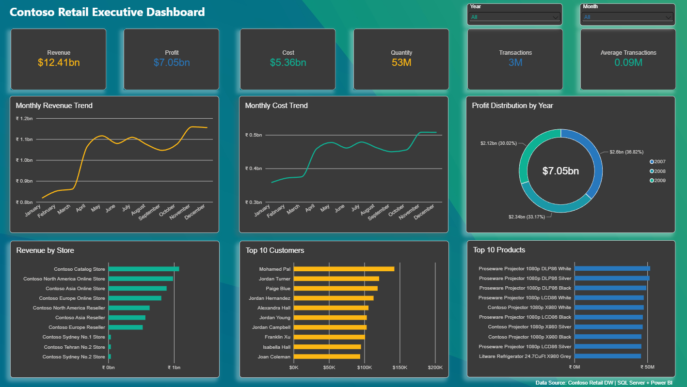

# Contoso Retail Executive Dashboard

## Overview

This project demonstrates an end-to-end Business Intelligence solution built using SQL Server and Power BI.

The project includes data exploration, business analysis, SQL views, stored procedures, and an interactive executive dashboard.

---

## Tools

- SQL Server
- SSMS
- Power BI Desktop
- DAX

---

## SQL Work

✔ Data Exploration

✔ Business Queries

✔ SQL Views

✔ Stored Procedures

---

## Dashboard Features

- Executive KPI Cards
- Monthly Revenue Trend
- Monthly Cost Trend
- Profit Distribution
- Revenue by Store
- Top 10 Customers
- Top 10 Products
- Interactive Year & Month Slicers

---

## Key Metrics

- Revenue
- Profit
- Cost
- Quantity Sold
- Transactions
- Average Transaction Value

---

## Project Structure

SQL/
Dashboard/
Images/

---

## Dashboard Preview

---

## Author

Indraj Ghosh